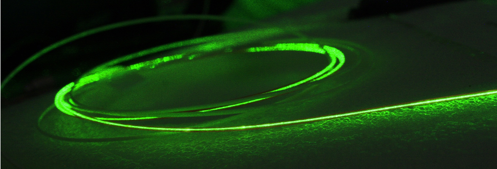
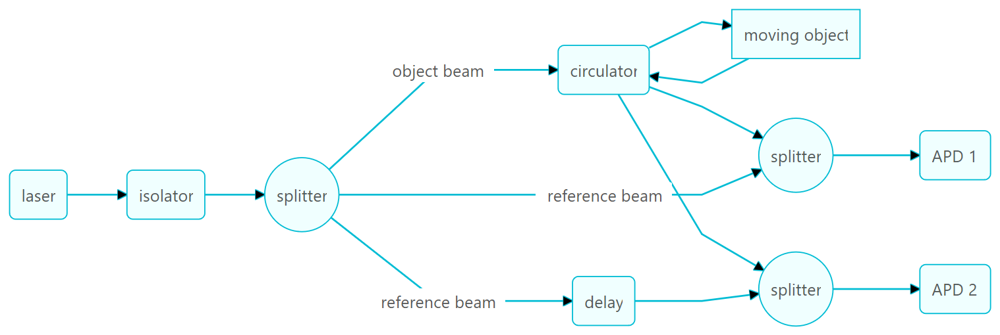
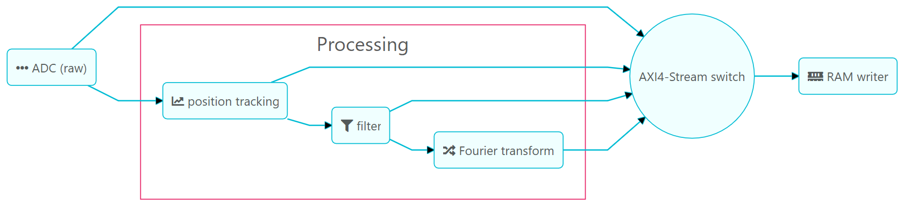
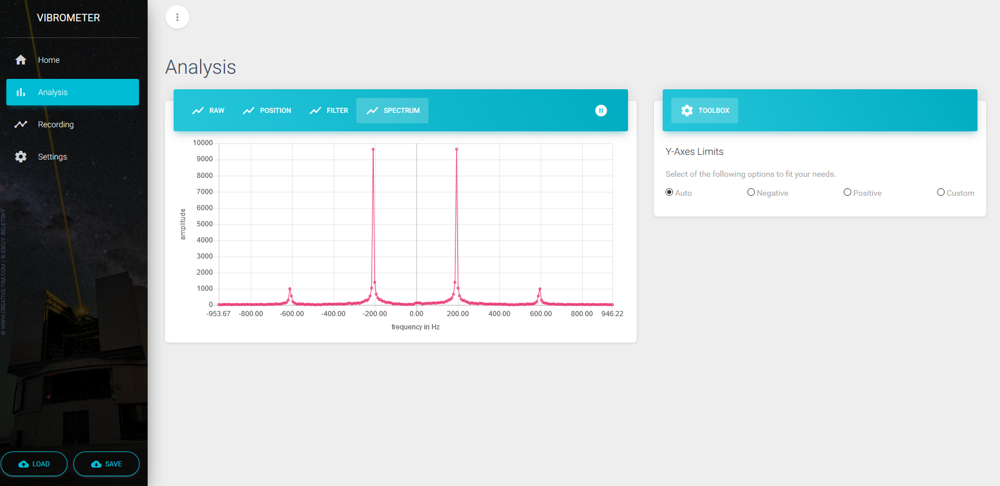
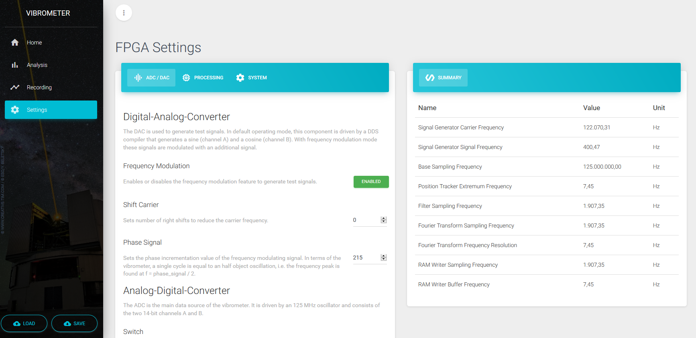

# FPGA-based Vibrometer

The vibrometer consist of three major parts to enable the high-speed vibration measurement: (1) the fiber interferometer, (2) the FPGA based data processing unit and (3) the user interface. The fiber interferometer is required to make use of the underlying physical principles, i.e interference and the Doppler effect. The conversion from light to a measurable electrical signal is done by an Avalanche photodiode which is capable of detecting also lowest light intensities. The FPGA measures the amplified photodiode signal and performs the computationally intensive post processing in real time. The last part - the user interface - visualizes the measurement data and allows to control the vibrometer, i.e. loading the FPGA bitstream and tune different parameters that affect the processing.

## Interferometer

The interferometer is the heart of the vibrometer. The first element is a 532 nm laser which is protected from reflected light by an isolator and connected to the first beam splitter where the object and low power reference beams are created. The object beam continues to the circulator where it enters at port 1 (one the left) and exits at port 2 (one the right). This beam is intended for the measurement on the vibrating object, where the beam is reflected with a certain frequency shift due to the Doppler effect. The beam reenters the circulator at port 2 and leaves it at port 3 (bottom). The reflected and frequency shifted object beam and the reference beam are recombined using another splitter where the actual interference occurs. On the other end of the splitter, an Avalanche photodiodes (APD) measures the resulting beams intensity. The second APD has a similar setup with an additional delay element to shift the reference signal by a quarter wavelength. In combination with the first APD, it is possible to derive the direction of the object's movement.

## FPGA

The FPGA board is located directly behind the two Avalanche Photodiodes (APD) of the interferometer. It's first task is the analog to digital conversion (ADC) of both photodiodes signals. These raw signals are streamed to the position tracking module where the oscillations are counted (the count direction directly depends on the direction of the object's movement) to reconstruct the object's position. If only one APD is connected, there is only one count direction whichs introduces harmonic frequencies. To reduce this effect, the signal can optionally be filtered by a differentiator module. Finallye, the signal is Fourier transformed to estimate the signal's spectral components. Via the RAM writer module, the resulting data stream is pushed into a preallocated RAM region using direct memory access. After the data stream is written into the RAM, the operating system can access the data for further processing. The FPGA bitstream additionally allows different data streams to be written into the RAM with the help of the AXI-4 stream switch. For testing, there is also a signal generation module (not shown in the figure) utilizing the digital-analog converters (DAC) of the FPGA board.

## User interface

The user interface is based on ASP.NET Core (web server) and [Blazor](https://blazor.net/) (web client), which in combination allow full-stack web-development with C#. The real-time communication is accomplished with [SignalR](https://dotnet.microsoft.com/apps/aspnet/real-time), a websockets based API to allow remote-procedure calls for duplex communcation.

The figure below shows the analysis page of the web client. The [sample](sample/sample.vib.json) configuration file has been loaded to confgure the FPGA. In this sample, the signal generating feature is activated to create two phase-shifted, frequency modulated signals. The two RF outputs of the FPGA board ([STEMlab 125-14](https://www.redpitaya.com/f130/STEMlab-board)) are directly connected to the two RF inputs via two SMA cables to measure the generated signals. The output signals are configured with a frequency of 400 Hz. But a real object oscillation consists of two sinusoidal movements (back and forth), and therefore the frequency is halved to 200 Hz, which can be found as a peak in the spectrum below.

The next figure shows the configuration page where all FPGA parameters can be modified. A summary of the low-level FPGA settings is shown on the right to get a quick overview of the internal frequencies. The settings page also allows the upload of a bitstream file which will be written directly to the FPGA.

