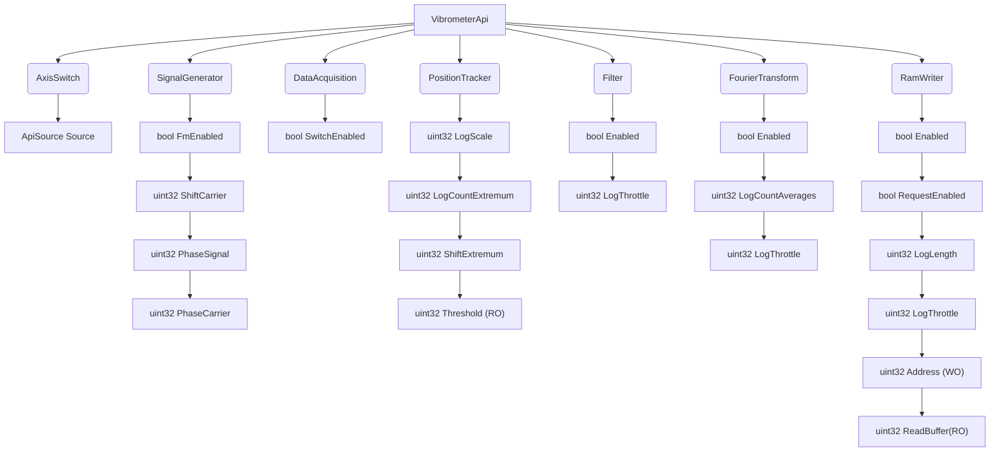

<!-- 
{
  "theme": null,
  "themeCSS": "#subGraph0 { fill:white}  .node > rect, circle { stroke:#00BCD4;} .cluster > rect { stroke:#E61E63;} .edgeLabel { display:block;opacity:1;background:white;border-radius:5px;padding:0px 10px;} .node { fill: azure } path { stroke-width: 1.5px; stroke: #00BCD4} polygon{ stroke-width: 1.5px; stroke: #00BCD4} text { fill:rgba(0, 0, 0, 0.65); font-size: 22px; transform: translateX(0px) translateY(15px) } div { text-align:center }",
  "flowchart": {
    "curve": "line"
  }
}
 -->